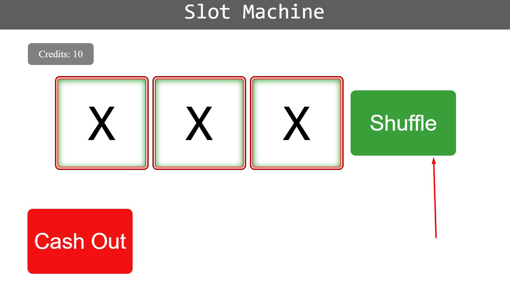

[Home](../../README.md)
- [Slot machine work flow](Slotemachine-Work-Flow.md)
- [SlotMachine](Slotmachine.md)
- [ScriptJs](scriptjs.md)

# Slot Machine: 
We will cover entire section of Slot machine and it's functionality step by step.
  
# Documentation : Working of Slot machine functionality

## How To Use?
 
1. To use Slot machine sections, simply click on the shuffle button. It will show the random sign inside the 3 blocks screen. If all signs are same then credits value will increase based on the sign showing. Otherwise if at least one sign is different in any block screen then 1 credit will loose by user. if user will click on shuffle button, one audio tune will play and shuffle button will disable to prevent clicking on multiple times. 
  
2. If user will hovering on the "Cash Out" button then there are chances of not able to clicking on it and it may move to left, right and top. But if user will able to click it then its credit will move to user account and shuffle button will disable till user does not refresh the page.

    

__
This is all about How you can play the game.
__

