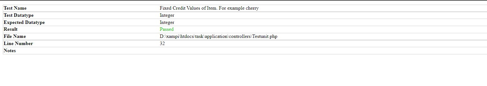

[Home](../../README.md)
- [Slot machine work flow](Slotemachine-Work-Flow.md)
- [SlotMachine Controller](Slotmachine.md)
- [ScriptJs](scriptjs.md)

# SlotMachine Controller

This controller is used to do unit testing. I have created one test case in which I am expecting that cherry sign should have 10 credits.
    
Output is passed: 

